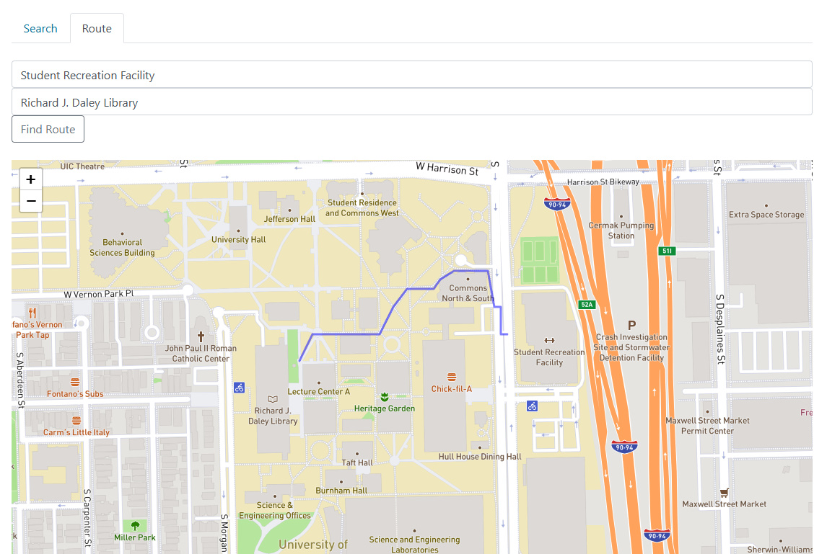

# CS-251-Project-6: OpenStreetMaps

Built a directed, weighted graph using adjacency lists.  
Parsed real-world data from JSON-format OSM exports.  
Path-searching-using-Dijkstra's algorithm  
Visualized through local web server  

Project Structure:  
  graph.h # define Graph class (adjacency list)
  application.cpp # build graph and implement dijkstra
  dist.h # calculates distance
  server.cpp # local web server for visualization

Test Commands: # verify graph integrity, data parsing, path correctness
  make test_graph
  make test_build_graph  
  make test_dijkstra  

Build & Run Commands:  
  # Build tests  
  make osm_tests  
  make test_all  

  # Run terminal-based path finder  
  make run_main  

  # Run local visualization server  
  make run_server

# Images
Case: Shortest Path from 'Student Recreation Facility' to Richard J. Daley Library'

  
